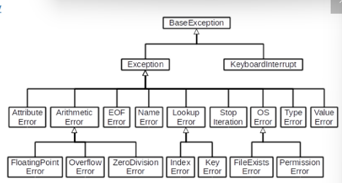

# 상속

## 상속의 기본 개념

- **상속 : 한 클래스(부모)의 속성과 메서드를 다른 클래스(자식)가 물려받는 것**

- 상속이 필요한 이유 :   
 1. 기존 클래스의 속성과 메서드 코드 재사용
 2. 클래스들 간 계층 구조 형성
 3. 유지보수가 용이

 - 상속의 예시
 ```python
 class Animal:
    def eat(self):
        print('먹는 중')

class Dog(Animal):
    def bark(self):
        print('멍멍')

my_dog = Dog()
my_dog.bark() # 멍멍

# 부모 클래스 사용 가능
my_dog.eat() # 먹는 중
 ```

## 클래스 상속

- 상속 없이 구현하는 경우 각각의 클래스가 가지는 고유 속성을 표현하기 어려움

- 중복되는 속성이나 메서드를 부모 클래스에서 한 번만 정의하고, 필요한 클래스들이 이 부모 클래스를 물려받는 방식으로 사용할 수 있음

## 메서드 오버라이딩

- 메서드 오버라이딩 : 부모 클래스의 메서드를 같은 이름, 같은 파라미터 구조로 재정의하는 것

- 자식 클래스에서 메서드를 다시 정의하면, 부모 클래스의 메서드 대신 자식 클래스의 메서드가 실행됨

```python
class Animal:
    def eat(self):
        print('Animal이 먹는 중')


class Dog(Animal):
    # 오버라이딩 (부모 클래스 Animal의 eat 메서드를 재정의)
    def eat(self):
        print('Dog가 먹는 중')

my_dog = Dog()
my_dog.eat() # Dog가 먹는 중
```

- [참고] 오버로딩(Overloading)
    - 같은 이름, 다른 파라미터를 가진 여러 메서드를 정의하는 것(파이썬은 미지원)

    - 파이썬의 경우 마지막으로 선언된 메서드만 인식함

    ```python
    # 오버로딩 (파이썬 미지원)
    class Example:
    def do_something(self, x):
        print('첫 번째 do_something 메서드:', x)

    # 파이썬에서는 메서드가 "이름"이 같으면 앞선 정의를 덮어써버림
    def do_something(self, x, y):
        print('두 번째 do_something 메서드:', x, y)


    example = Example()
    # TypeError: do_something() missing 1 required positional argument: 'y'
    example.do_something(10)
    ```

## 다중 상속

- 둘 이상의 상위 클래스로부터 여러 행동이나 특징을 상속받을 수 있음

- 상속받은 것들 중 중복된 속성이나 메서드가 있는 경우 상속 순서에 의해 결정됨(**먼저 작성한 순서**대로 참조)

- MRO(Method Resolution Order) 알고리즘을 사용하여 클래스 목록을 생성하는 것으로 다이아몬드 문제(The diamond Problem)를 해결함
    - MRO : 파이썬의 메서드 결정 순서
    
- 속성이 D에서 발견되지 않으면 B에서 찾고, 거기에서도 발견되지 않으면 C에서 찾음
```python
class D(B,C):
    pass
```

## `super()` 메서드

- `super()` : 메서드 해석 순서(MRO)에 따라서, 현재 클래스의 부모(상위) 클래스의 메서드나 속성에 접근할 수 있게 해 주는 내장함수

- `super()`의 2가지 사용 사례

 1. 단일 상속 구조 : 유지보수성 향상
 ```python
 class Person:
    def __init__(self, name, age, number, email):
        self.name = name
        self.age = age
        self.number = number
        self.email = email


class Student(Person):
    def __init__(self, name, age, number, email, student_id):
        # super()를 통해 Person의 __init__ 메서드 호출
        super().__init__(name, age, number, email)
        self.student_id = student_id
 ```

 2. 다중 상속 구조
 ```python
 # 다중 상속
class ParentA:
    def __init__(self):
        # super().__init__()
        self.value_a = 'ParentA'

    def show_value(self):
        print(f'Value from ParentA: {self.value_a}')


class ParentB:
    def __init__(self):
        self.value_b = 'ParentB'

    def show_value(self):
        print(f'Value from ParentB: {self.value_b}')


class Child(ParentA, ParentB):
    def __init__(self):
        super().__init__()  # ParentA 클래스의 __init__ 메서드 호출
        self.value_c = 'Child'

    def show_value(self):
        super().show_value()  # ParentA 클래스의 show_value 메서드 호출
        print(f'Value from Child: {self.value_c}')
    

child = Child()
child.show_value()
"""
Value from ParentA: ParentA
Value from Child: Child
"""

print(child.value_c)  # Child
print(child.value_a)  # ParentA
print(
    child.value_b
)  # AttributeError: 'Child' object has no attribute 'value_b'
 ```
- `super()`의 활용
 ```python
 
# <ParentA에 super().__init__()를 추가하면?>
"""
그 다음으로 ParentB의 __init__가 실행되어 value_b도 초기화할 수 있음
그러면 print(child.value_b)는 ParentB를 출력하게 됨
"""
print(child.value_b)  # ParentB

# <Child 클래스의 MRO>
"""
Child -> ParentA -> ParentB

super()는 단순히 “직계 부모 클래스를 가리킨다”가 아니라, 
MRO 순서를 기반으로 “현재 클래스의 다음 순서” 클래스(또는 메서드)를 가리킴

따라서 ParentA에서 super()를 부르면 MRO상 다음 클래스인 ParentB.__init__()가 호출됨
"""
```
- `.mro()`를 이용하면 상속하는 클래스의 순서 확인 가능


# 에러와 예외

## 디버깅

- 버그(bug) : 소프트웨어에서 발생하는 오류 또는 결함
- 디버깅(Debugging) : 소프트웨어에서 발생하는 버그를 찾아내고 수정하는 과정

## 에러
- 프로그램 실행 중에 발생하는 예외 상황

- 에러의 유형
 1. 문법 에러(SyntaxError) : 프로그램의 구문이 올바르지 않은 경우 발생
 2. 예외(Exception) : 프로그램 실행 중에 감지되는 에러

## 예외
- 예외(Exception) : 프로그램 실행 중에 감지되는 에러
- 내장 예외 : 에외 상황을 나타내는 예외 클래스들
 1. ZerodivisionError : 나누기 또는 모듈로 연산의 두 번째 인자가 0인 경우 발생
 2. TypeError : 타입 불일치 / 인자 누락 / 인자 초과/ 인자 타입 불일치
 3. NameError : 지역 또는 전역 이름을 찾을 수 없는 경우 발생
 4. ValueError
 5. IndexError
 6. KeyError

 -> 다양한 에러들이 클래스 형태로 분류되어 있음

# 예외 처리

- 예외가 발생했을 때 프로그램이 비정상적으로 종료되지 않고, 적절하게 처리할 수 있도록 하는 방법

## `try` & `except`

- `try` : 예외가 발생할 수 있는 코드
- `except (Error)` : 예외 처리 코드

```python
try:
    result = 10 / 0
except ZeroDivisionError:
    print('0으로 나눌 수 없습니다.')
```


## 복수 예외 처리
```python
# 복수 예외처리
try:
    num = int(input('100을 나눌 값을 입력하시오 : '))
    print(100 / num)
except (ValueError, ZeroDivisionError):
    print('제대로 입력해주세요.')
```
```python
# 복수 예외처리 2
try:
    num = int(input('100을 나눌 값을 입력하시오 : '))
    print(100 / num)
except ValueError:
    print('숫자를 넣어주세요.')
except ZeroDivisionError:
    print('0으로 나눌 수 없습니다.')
except:
    print('에러가 발생했습니다.')
```

## `else` & `finally`

- `else` : 예외가 발생하지 않았을 때 추가 작업을 진행
- `finally` : 예외 발생 여부와 상관없이 항상 실행할 코드 작성

```python
try:
    x = int(input('숫자를 입력하세요: '))
    y = 10 / x
except ZeroDivisionError:
    print('0으로 나눌 수 없습니다.')
except ValueError:
    print('유효한 숫자가 아닙니다.')
else:
    print(f'결과: {y}')
finally:
    print('프로그램이 종료되었습니다.')
```

# 참고

## 예외 처리 주의사항

- 내장 예외 클래스는 상속 계층구조를 가지고 있기 때문에 `except`절로 분기 시 반드시 하위 클래스를 먼저 확인할 수 있도록 작성해야 함


- 가장 구체적인 예외부터 처리하고, 마지막에 범용적인 예외 처리(`except Exception`) 구문을 처리하도록 순서를 배치해야 함   

ex) 바람직한 예외 처리 예시   
```python
# 가장 구체적인 예외부터 처리하고, 마지막에 범용 예외를 처리하도록 순서를 배치
try:
    num = int(input('100으로 나눌 값을 입력하시오 : '))
    print(100 / num)
# 1) 구체적인 예외부터
except ZeroDivisionError:
    print('0으로 나눌 수 없습니다.')
except ValueError:
    print('숫자를 넣어주세요.')
# 2) 마지막에 광범위한 예외(Exception)
except Exception:
    print('에러가 발생하였습니다.')
```

## 예외 객체 다루기
- `as`를 활용하여 예외 객체를 받아 상세한 예외 정보를 활용 가능
- `try-except`와 `if-else`를 함께 사용할 수 있음

## EAFP & LBYL

- EAFP(Easier to Ask for Forgiveness than Permission) : 예외처리를 중심으로 코드를 작성하는 접근 방식
- 일단 지르고, 예외 발생하면 그떄 처리하기(`try-except`)
- 예외 상황을 예측하기 어려운 경우에 유용
---
- LBYL(Look Before You Leap): 값 검사를 중심으로 코드를 작성하는 접근 방식
- 돌다리 두들기면서 건너기(`if-else`)
- 예외 상황을 미리 방지하고 싶을 때 유용

## 클래스의 의미와 활용
- 지금 당장 알고리즘 문제에는 클래스가 안 쓰일 수도 있지만, 앞으로 더 복잡한 프로그램을 만들 때는 객체 지향 개념이 큰 그림을 잡고 코드를 효율적으로 관리하게 해 줄 것이다!

