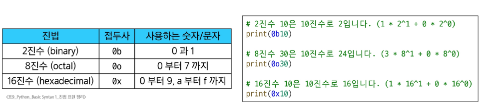

# 변수와 메모리

## 변수, 변수 할당
```python
degrees = 36.5
```

# Data types

## Type
변수나 값이 가질 수 있는 데이터의 종류를 의미 

1. **Numeric Types** :   
    <span style="color:green"> ex) int, double, float, complex </span>
2. **Text Sequence Types** :   
    <span style="color:green"> ex) str </span>   
  * 시퀀스 타입의 특징 : 순서 / 인덱싱/ 슬라이싱/ 길이 / 반복
  * 코드에서 따옴표는 작은따옴표('')로 통일하는 게 좋다. 따옴표 안에 따옴표를 넣고 싶다면 이스케이프 시퀀스(\\) 활용하기
  *  f-string : 문자열 안에 값 삽입하기 // 심화 사용법 익히기(숙제)
  
  *  python은 음수 인덱스도 지원한다
  *  슬라이싱 사용법
    ```python
    my_sequence[start : stop : step]
    # start : 포함 / stop : 포함 안됨 / step :  건너뛰는 크기
    ```

  * 문자열은 불변성을 가진다
   
   

 3. **Sequence Types**   
    <span style="color:green"> ex) list, tuple, range </span>
 4. **Non-sequence Types**  
    <span style="color:green"> ex) set, dict </span>
 5. **기타**   
    <span style="color:green"> ex) Boolean, None, Functions </span>

### 헷갈리는 예제
- 재할당 점검
```python
# x의 값은?
number = 10
x = 2 * number
print(x) # x = 20

number = 5
print(x) # x = ?
```
답은 20. x는 재할당된 number의 영향을 받지 않는다!

- 연산자 우선순위 점검
```python
# 결과는?
-2 ** 4
```
답은 -16. -보다 거듭제곱 **이 우선순위가 더 높기 때문!

- 슬라이싱 점검
```python
my_str = "hello"
my_str[::-1] # 결과는?
```
답은 "olleh". 이 표현은 유용하니 암기해 두자

### 참고
* 정수형의 진법 표현   
  
* 실수의 함정, 부동소수점 오차
  
  
  
* Style Guide : PEP 8(파이썬 코드의 공식 스타일 가이드)   
  
* 주석 :   
  ctrl + /