# 리스트(list)
- **list : 여러 개의 값을 순서대로 저장하는, 변경 가능한 자료형**
 
1. 대괄호 [] 안에 값들을 쉼표(,)로 구분하여 만듦
2. 숫자, 문자열, 다른 리스트까지 <span style="color:red">모든 종류의 데이터</span>를 담을 수 있음
3. 값을 추가, 수정, 삭제하는 등 자유롭게 변경 가능
```python
# 리스트 표현
my_list_1 = []
my_list_2 = [1, 'a', 3, 'b', 5]
my_list_3 = [1, 2, 3, 'Python', ['hello', 'world', '!!!']]
```

- 인덱싱 / 슬라이싱 / 길이
  ```python
  my_list = [1, 'a', 3, 'b', 5]

  # 인덱싱
  print(my_list[1])  # a

  # 슬라이싱
  print(my_list[2:4])  # [3, 'b']
  print(my_list[:3])  # [1, 'a', 3]
  print(my_list[3:])  # ['b', 5]
  print(my_list[::2])  # [1, 3, 5]
  print(my_list[::-1])  # [5, 'b', 3, 'a', 1]

  # 길이
  print(len(my_list))  # 5

  # 중첩된 리스트 접근
  my_list = [1, 2, 3, 'Python', ['hello', 'world', '!!!']]
  print(len(my_list))  # 5
  print(my_list[4][-1])  # !!!
  print(my_list[-1][1][0])  # w
  ```
  
- 리스트의 가변성
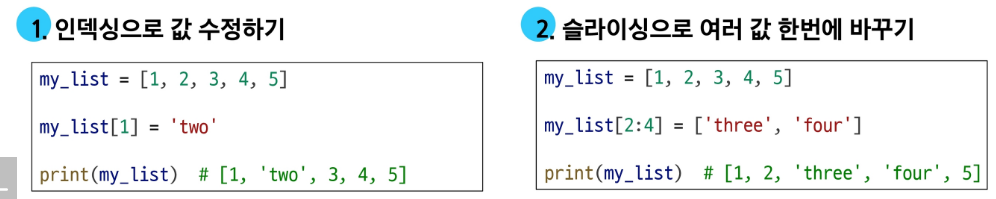

# 튜플(tuple)
- **tuple : 여러 개의 값을 순서대로 저장하는 변경 불가능한 시퀀스 자료형**

1. 소괄호 () 안에 값들을 쉼표(,)로 구분하여 만듦
2. 모든 종류의 데이터를 담을 수 있음
3. 리스트와 거의 모든 면에서 비슷하지만, 수정 불가능하다는 결정적인 차이가 있음
4. 소괄호 없이도 만들 수 있음
5. 단일 요소 튜플을 만들 때는 반드시 trailing comma(후행 쉼표)를 사용해야 함

```python
my_tuple_1 = ()
my_tuple_2 = (1, ) # 요소가 1개인 튜플을 만드는 방법 : (element, )
my_tuple_3 = (1, 'a', 3, 'b', 5)
my_tuple_4 = 1, 'hello', 3.14, True
```

# range

## range의 규칙
- 값의 범위 규칙 : stop 값은 생성되는 시퀀스에 포함되지 않는다.
- 증가/감소 값(step) 규칙 : step 값은 숫자 시퀀스의 간격과 방향을 결정한다.
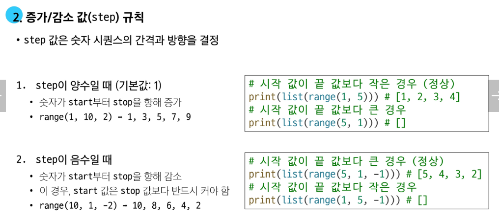

# 딕셔너리(Dictionary)
- **dictionary : key-value 쌍으로 이루어진 순서와 중복이 없는, 변경 가능한 자료형**
1. 중괄호 {} 안에 값들을 쉼표로 구분함
2. 값 1개는 key와 value가 쌍으로 이루어져 있음
3. 각 값에는 순서가 없음
```python
# 딕셔너리 표현
my_dict_1 = {}
my_dict_2 = {'key': 'value'}
my_dict_3 = {'apple': 12, 'list':[1, 2, 3]}

print(my_dict_1)  # {}
print(my_dict_2)  # {'key': 'value'}
print(my_dict_3)  # {'apple': 12, 'list': [1, 2, 3]}
```
- 딕셔너리는 key를 통해 value에 접근한다
```python
my_dict = {'name': '홍길동', 'age': 25}
print(my_dict['name'])  # '홍길동'
print(my_dict['test'])  # KeyError: 'test'
```
- 딕셔너리 값 추가 및 변경
```python
# 딕셔너리 값 추가 및 변경
my_dict = {'apple': 12, 'list': [1, 2, 3]}
# 추가
my_dict['banana'] = 50
print(my_dict)  # {'apple': 12, 'list': [1, 2, 3], 'banana': 50}

# 변경
my_dict['apple'] = 100
print(my_dict)  # {'apple': 100, 'list': [1, 2, 3], 'banana': 50}
```
* 주로 API 만들 때 사용


# 집합(Set)
- **set : 순서와 중복이 없는 변경 가능한 자료형**

1. 중괄호 {} 안에 값들을 쉼표(,)로 구분하여 만듦
2. 수학에서의 집합과 동일한 연산 처리 가능

```python
# 세트 표현
my_set_1 = set()
my_set_2 = {1, 2, 3}
my_set_3 = {1, 1, 1}

print(my_set_1)  # set()
print(my_set_2)  # {1, 2, 3}
print(my_set_3)  # {1}
```
- set의 집합 연산
```python
# 세트의 집합 연산
my_set_1 = {1, 2, 3}
my_set_2 = {3, 6, 9}

# 합집합
print(my_set_1 | my_set_2)  # {1, 2, 3, 6, 9}

# 차집합
print(my_set_1 - my_set_2)  # {1, 2}

# 교집합
print(my_set_1 & my_set_2)  # {3}
```

# Other types
## None
- **None : 파이썬에서 '값이 없음'을 표현하는 특별한 data type**
- 주의 : 'N'은 대문자로 표기해야 함

## Boolean
- **Boolean : '참(True)'과 '거짓(False) 단 두 가지 값만 가지는 데이터 타입**
- 주의 : 'True', 'False'의 'T', 'F'는 대문자로 표기해야 함

---

# 정리

## Collection
- **Collection : 여러 개의 값을 하나로 묶어 관리하는 자료형들을 통칭하는 말**   
ex) str, list, tuple, range, set, dict 등
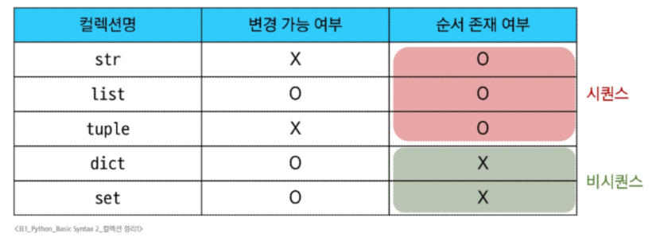

## 불변 vs 가변
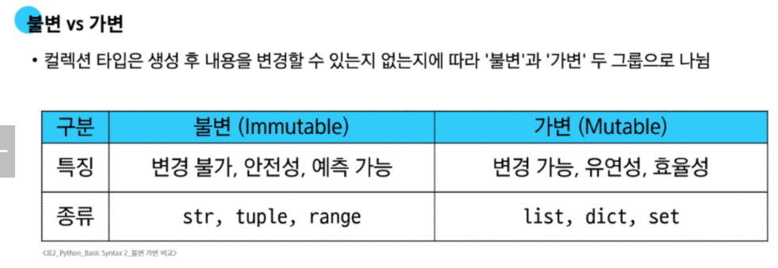
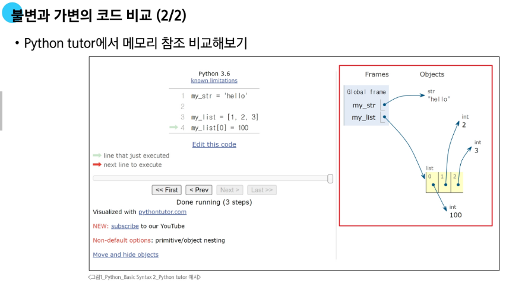

* 가변형이 수정 가능한 이유 : memory 할당
* 숙제) 얉은 복사 vs 깊은 복사

## 형변환
- **형 변환 : 한 데이터 타입을 다른 데이터 타입으로 변환하는 과정**
- 암시적 형변환 : 파이썬이 자동으로 처리, 파이썬이 데이터 손실을 막기 위해 더 정밀한 타입으로 자동 변환해주는 규칙
```python
# 암시적 형변환
# 정수(int)와 실수(float)의 덧셈
print(3 + 5.0)  # 8.0
# 불리언(bool)과 정수(int)의 덧셈
print(True + 3)  # 4
# 불리언간의 덧셈
print(True + False)  # 1
```
- 명시적 형변환 : 개발자가 직접 지시, 서로 다른 타입의 데이터를 호환되도록 변환
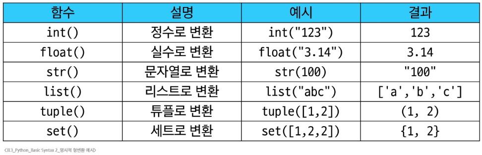

```python
# 명시적 형변환
# str -> int
print(int('1'))  # 1
# ValueError: invalid literal for int() with base 10: '3.5' // 형식에 맞는 숫자만 가능
# print(int('3.5')) 
print(int(3.5))  # 3
print(float('3.5'))  # 3.5

# int -> str
print(str(1) + '등')  # 1등
```

# 연산자
1. 산술 연산자
   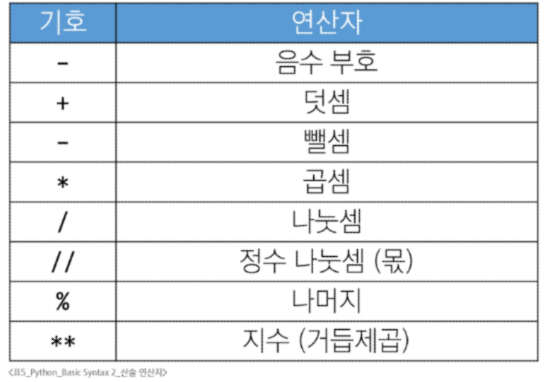
2. 복합 연산자
   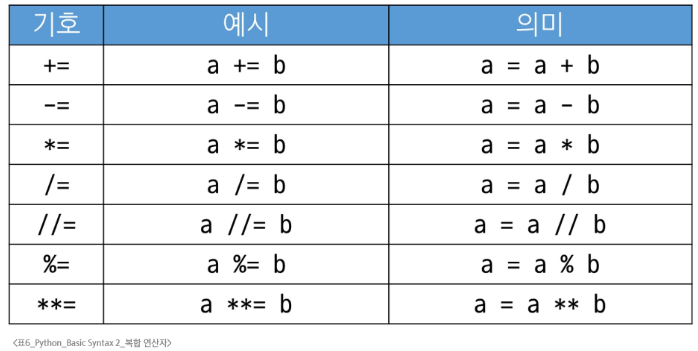
3. 비교 연산자
   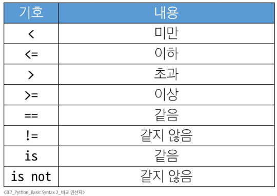
   - <span style="color:red"> 참고) **== vs is** </span>
   - == 은 값 자체를 비교, is는 객체(값 + 주소)가 같은지 비교
    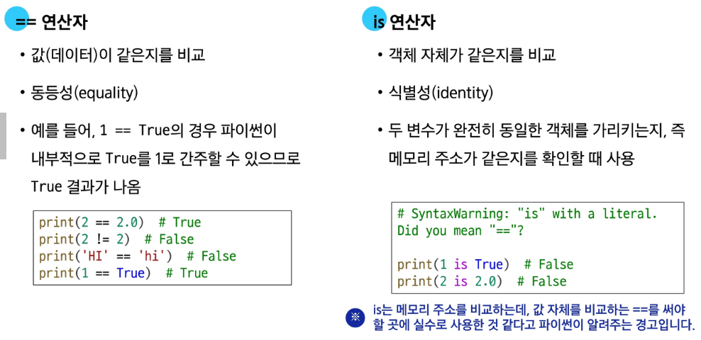
   - 값 비교에는 ==을 사용해야 하고, is는 Singleton 객체(<span style="color:green"> ex. None, True, False</span>) 비교 시에 사용하자!
4. 논리 연산자
   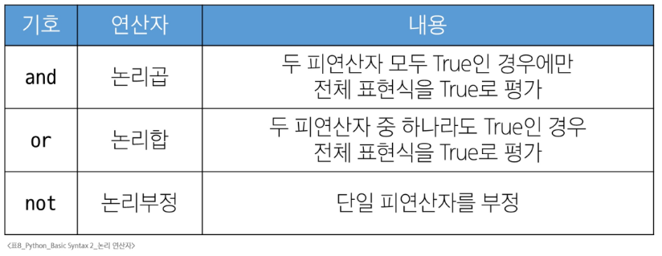
   - 논리 연산 중 앞의 연산으로 결과가 이미 결정되면, 뒤의 연산을 수행하지 않음(단축 평가)
5. 멤버십 연산자
   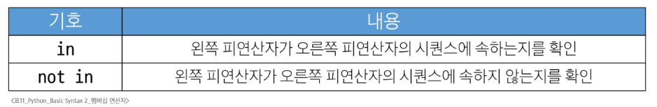
6. 시퀀스형 연산자
   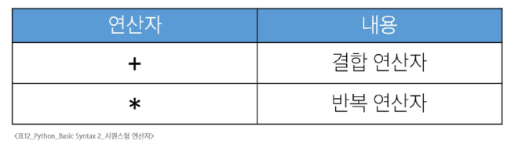
- 연산자 우선순위 정리 :
- <span style="color:pink"> 괄/ 인/ 거/ 산/ 비/ 멤/ 논 </span>
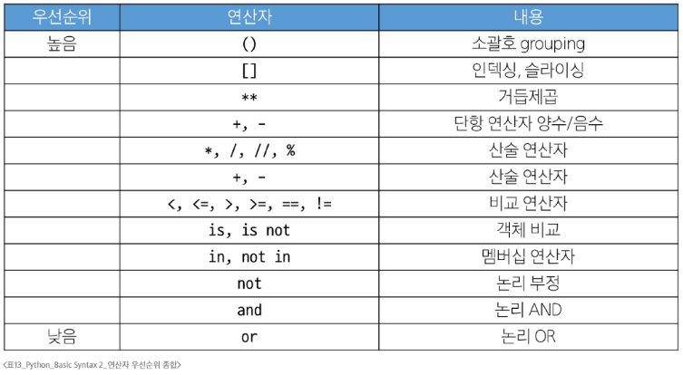