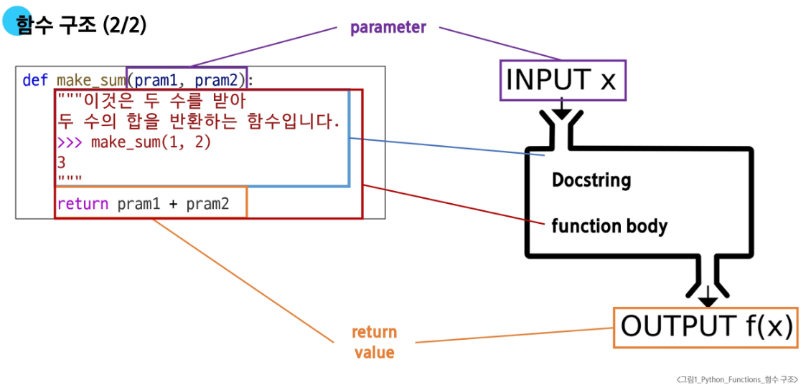
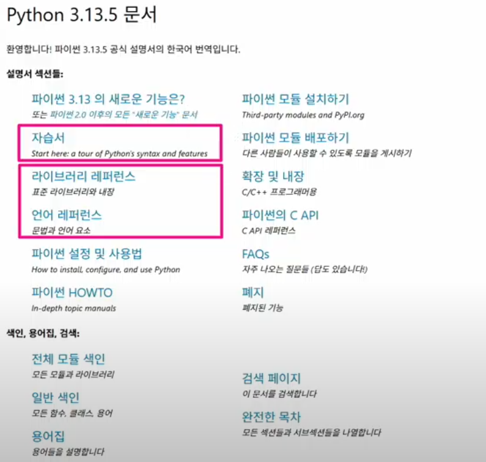
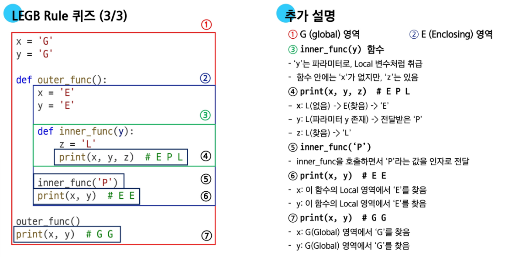
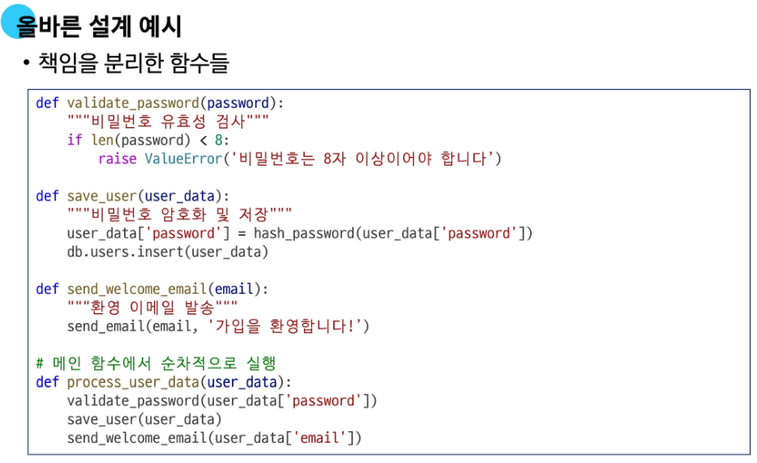
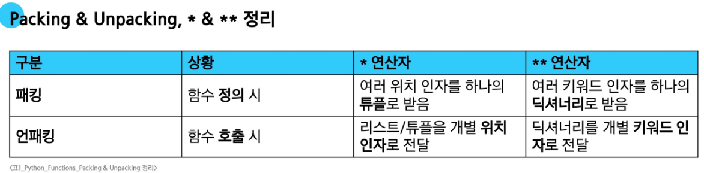

# 함수(Function)

## 함수의 개념과 정의
- **함수 : 특정 작업을 수행하기 위한 재사용 가능한 코드 묶음**
- 코드의 중복을 방지하고, 재사용성이 높아지며, 코드의 가독성과 유지보수성 향상   

- 함수의 구조   
  
  ```python
  def function_name(par1, par2, ...) :
  """
  Docstring
  """
  body code
  return
  ```

- 함수의 정의와 호출
  1. 함수 정의는 def 키워드로 시작
  2. def 키워드 이후 함수 이름 작성
  3. 괄호 안에 매개변수를 정의할 수 있음
  4. 매개변수(parameter)는 함수에 전달되는 값
   
- <span style="color:orange">참고 : `print()` 함수는 반환값이 없다!</span>  
   -> `print()` 함수는 화면에 값을 출력하기만 할 뿐, 반환(return)값이 없음

   ```python
   # print() 함수는 반환값이 없다.
  return_value = print(1)
  print(return_value) # None
  ```

## 매개변수와 인자
- **매개변수(parameter) : 함수를 정의할 때, 함수가 받을 값을 나타내는 변수**
- **인자(argument) : 함수를 호출할 때, 실제로 전달되는 값**

  1. 위치 인자 : 함수 호출 시 인자의 위치에 따라 전달되는 인자    
  ```python
  # 1. Positional Arguments
  def greet(name, age):
    print(f'안녕하세요, {name}님! {age}살이시군요.')

  greet('Alice', 25)  # 안녕하세요, Alice님! 25살이시군요.
  greet(25, 'Alice')  # 안녕하세요, 25님! Alice살이시군요.
  greet('Alice')  # TypeError: greet() missing 1 required positional argument: 'age'
  ```
  2. 기본 인자 값: 함수 정의에서 매개변수에 기본 값을 할당하는 것.   
  함수 호출 시 인자를 전달하지 않으면, 기본값이 매개변수에 할당됨.
  ```python
  # 2. Default Argument Values
  def greet(name, age=20):
  print(f'안녕하세요, {name}님! {age}살이시군요.')

  greet('Bob')  # 안녕하세요, Bob님! 30살이시군요.
  greet('Charlie', 40)  # 안녕하세요, Charlie님! 40살이시군요.
  ```
  3. 키워드 인자 : 함수 호출 시 인자의 이름과 함께 값을 전달하는 인자.   
  <span style="color:red"> 단, 호출 시 키워드 인자는 위치 인자 뒤에 위치해야 함 </span>
  ```python
  # 3. Keyword Arguments
  def greet(name, age):
    print(f'안녕하세요, {name}님! {age}살이시군요.')

  greet(name='Dave', age=35)  # 안녕하세요, Dave님! 35살이시군요.
  greet(age=35, name='Dave')  # 안녕하세요, Dave님! 35살이시군요.
  greet(age=35, 'Dave')  # Positional argument cannot appear after keyword arguments
  ```
  4. 임의의 인자 목록 : 정해지지 않은 개수의 인자를 처리하는 인자. 함수 정의 시 매개변수 앞에 '<span style="color:red">*</span>'을 붙여 사용한다.   
  <span style="color:orange"> 여러 개의 인자를 'tuple'로 처리</span>한다
  ```python
  # 4. Arbitrary Argument Lists
  def calculate_sum(*args):
    print(args)  # (1, 100, 5000, 30)
    print(type(args))  # <class 'tuple'>

  calculate_sum(1, 100, 5000, 30)
  ```
  1. 임의의 키워드 인자 목록 : 정해지지 않은 개수의 키워드 인자를 처리하는 인자. 함수 정의 시 매개변수 앞에 '<span style="color:red">**</span>'을 붙여 사용한다.   
  <span style="color:orange">여러 개의 인자를 'dictionary'로 묶어 처리</span>한다
  ```python
  # 5. Arbitrary Keyword Argument Lists
  def print_info(**kwargs):
    print(kwargs)

  print_info(name='Eve', age=30)  # {'name': 'Eve', 'age': 30
  ```
- 함수 인자 권장 작성 순서 :   
  ** <span style="color:pink">위치 -> 기본 -> 가변 -> 가변 키워드</span> **   
  (단, 모든 상황에 적용되는 절대적인 규칙은 아니며, 상황에 따라 유연하게 조정될 수 있음)

<span style="color:green"> ex) 인자의 모든 종류를 적용한 예시</span>
```python
# 인자의 모든 종류를 적용한 예시
def func(pos1, pos2, default_arg='default', *args, **kwargs):
    print('pos1:', pos1)
    print('pos2:', pos2)
    print('default_arg:', default_arg)
    print('args:', args)
    print('kwargs:', kwargs)


func(1, 2, 3, 4, 5, 6, key1='value1', key2='value2')

"""
pos1: 1
pos2: 2
default_arg: 3
args: (4, 5, 6)
kwargs: {'key1': 'value1', 'key2': 'value2'}
"""
```
- <span style="color:pink"> 참고) Python은 함수 인자의 type을 강제하지는 못하지만, guide를 제공해 줄 수는 있다! (규율이 약함) </span>  
<span style="color:green">ex) `def sum(a : int, b : int)` </span>

## 재귀 함수
- **재귀 함수 : 함수 내부에서 자기 자신을 호출하는 함수**
- <span style="color:green"> 재귀 함수의 대표적인 예시 </span>  : **팩토리얼(factorial)**
- 재귀 함수 활용 시 기억해야 할 것
  1. 종료 조건을 명확히 할 것
  2. 반복되는 호출이 종료 조건을 향하도록 할 것
  3. 재귀 함수는 메모리를 많이 사용하므로, 스택 오버플로가 되지 않도록 주의하여 코드를 짜야 함(너무 많이 반복 호출되지 않도록)
```python
  def factorial(n):
    # 종료 조건: n이 0이면 1을 반환
    if n == 0:
        return 1
    else:
        # 재귀 호출: n과 n-1의 팩토리얼을 곱한 결과를 반환
        return n * factorial(n - 1)

  # 팩토리얼 계산 예시
  print(factorial(5))  # 120
```

## 내장 함수(Built-in Function)
- 파이썬이 기본적으로 제공하는 함수(별도의 import 없이 바로 사용 가능)   
ex) `print()`, `len()`, `max()`, `min()`, `sum()`, `sorted` 등

- 더 많은 built-in function들은 ![파이썬 공식 문서] https://docs.python.org/ko/3.13/index.html 참조   


## 함수와 Scope
- 함수는 코드 내부에 local scope를 생성하며, 그 외의 공간은 global scope로 구분
- 변수 수명주기(lifecycle)
  1. built-in scope : 파이썬이 실행된 이후부터 영원히 유지
  2. global scope : 모듈이 호출된 시점 이후 혹은 인터프리터가 끝날 때까지 유지
  3. local scope : 함수가 호출될 때 생성되고, 함수가 종료될 때까지 유지
- 이름 검색 규칙 : 낮은 지역에서 높은 지역 쪽으로 이름을 찾아 나감(LEGB Rule)
  
- `global` 키워드 : 변수의 scope를 전역 범위로 자정하기 위해 사용. 일반적으로 함수 내에서 전역 변수를 수정하려는 경우에 사용한다.

## 함수 Style Guide
- 함수 이름 작성 규칙
  1. 소문자와 언더스코어(_) 사용 (snake_case)
  2. 동사로 시작하여 함수의 동작 설명
  3. 약어 사용 지양
  4. get/set 또는 is 등 적절한 format 사용 권장
```python
# Good
def calculate_total_price(price, tax):
    return price + (price * tax)

# Bad
def calc_price(p, t):
    return p + (p * t)
```
- 단일 책임 원칙(Single Responsibility Principle) : 모든 객체는 하나의 명확한 목적과 책임만을 가져야 함


## Packing & UnPacking

- **Packing : 여러 개의 데이터를 하나의 컬렉션으로 모아 담는 과정**
  1. '`*`'을 활용한 패킹(함수 매개변수 작성 시) : 남는 위치 인자들을 tuple로 묶기
   
  2.  '`**`'을 활용한 패킹(함수 매개변수 작성 시) : 남는 위치 인자들을 dictionary로 묶기

  - `print()` 함수의 패킹 예시

- **Unpacking : 컬렉션에 담겨 있는 데이터들을 개별 요소로 펼쳐 놓는 과정**
  1. '`*`'을 활용한 언패킹(함수 인자 전달 시) : list나 tuple 앞에 `*`를 붙여 각 요소를 함수의 개별 위치 인자로 전달
  ```python
  # ‘*’ 을 활용한 언패킹 (함수 인자 전달)
  def my_function(x, y, z):
    print(x, y, z)

  names = ['alice', 'jane', 'peter']
  my_function(*names)  # alice jane peter
  ``` 
  2. '`**`'을 활용한 언패킹(딕셔너리 -> 함수 키워드 인자) : dictionary 앞에 **를 붙여 {key : value} 쌍을 'key = value' 형태의 키워드 인자로 전달
  ```python
  # ‘**’을 활용한 언패킹 (딕셔너리 -> 함수 키워드 인자)
  def my_function(x, y, z):
    print(x, y, z)


  my_dict = {'x': 1, 'y': 2, 'z': 3}
  my_function(**my_dict)  # 1 2 3
  ```
  
## 참고

### 함수와 반환
- 파이썬 함수는 언제나 단 하나의 값(객체)만 반환할 수 있음
- 여러 값을 반환하는 경우에도, 하나의 tuple로 패킹하여 변환(반환된 튜플은 각 변수에 언패킹하여 사용할 수 있음)

```python
def get_user_info():
    name = 'Alice'
    age = 30
    # 콤마(,)로 여러 값을 반환하는 것처럼 보임
    return name, age


# 하지만 반환된 값을 user_data변수에 담아 확인해보면
user_data = get_user_info()

# 단 하나의 튜플을 반환하는 것 입니다.
print(user_data)  # ('Alice', 30)
```

### 람다 표현식(Lambda Expressions)
- 익명 함수를 만드는 데 사용되는 표현식으로, 한 줄로 간단한 함수를 정의할 수 있다   
<span style="color:green"> ex) 람다 표현식 활용 (w. `map` 함수) </span>
```python
# 람다 표현식 활용 - 1 (with map 함수)
numbers = [1, 2, 3, 4, 5]


def square(x):
    return x**2


# lambda 미사용
squared1 = list(map(square, numbers))
print(squared1)  # [1, 4, 9, 16, 25]

# lambda 사용
squared2 = list(map(lambda x: x**2, numbers))
print(squared2)  # [1, 4, 9, 16, 25]
```
