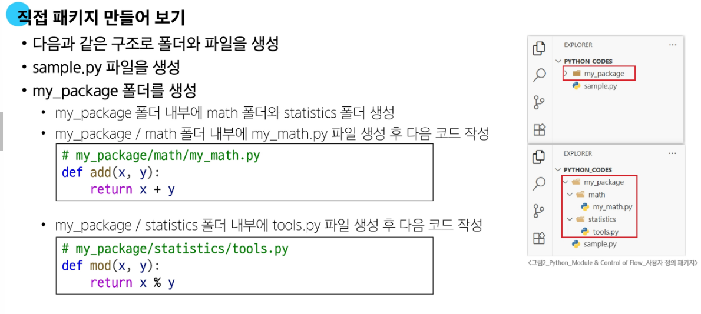
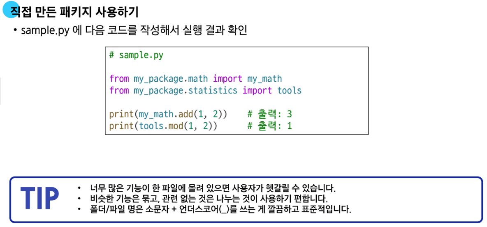

# 모듈(Module)
- **모듈(Module) : 한 파일로 묶인 변수와 함수의 모음, 특정한 기능읗 하는 코드가 작성된 Python file**

- 모듈의 사용
  1. `import`문을 이용한 모듈 사용   
  -> 같은 이름의 함수가 여러 모듈에 있을 때 충돌을 방지할 수 있음(권장)   
  -> '`.`(dot)' 연산자를 이용해 `.`의 왼쪽 객체에서 오른쪽 함수의 이름을 찾음

  ```python
  import math
  print(math.pi) # 모듈명.변수명
  print(math.sqrt(4))
  ```

  2. `from`절을 사용한 모듈 사용   
  -> 코드가 짧고 간결해지지만, 정의된 모듈의 위치를 알기 어려워 명시적이지 않고, 함수 충돌이 발생할 수 있음
  -> 마지막에 `import`된 것이 이전 것을 덮어쓰기 때문에 나중에 `import`된 것만 유효   
  -> 모든 요소를 한 번에 `import`하는 `*` 표기는 권장하지 않음   
  ex) `from math import *` (X)

   ```python
  from math import pi, sqrt
  print(math.pi) # 변수명
  print(sqrt(4))
  ```

  - 참고) `as` 키워드를 사용하여 함수의 별칭을 부여할 수 있음   
  -> 두 개 이상의 모듈에서 함수 이름 충돌 문제 해결, 함수나 변수명이 너무 긴 경우 쉽게 사용 가능

  ```python
  import pandas as pd
  import matplotlib.pyplot as plt
  ```

# 파이썬 표준 라이브러리(Python Standard Library, PSL)

- **파이썬 표준 라이브러리(Python Standard Library, PSL) : 파이썬 언어와 함께 제공되는 다양한 모듈과 패키지의 모음**

- https://docs.python.org/ko/3.13/library/index.html

## 패키지

- **패키지(Package) : 연관된 모듈들을 하나의 디렉토리에 모아 놓은 것**

- 직접 package를 만드는 방법(예시)   
  
  

- 패키지의 종류
  1. PSL 내부 패키지 : 파이썬을 설치하면 자동으로 사용할 수 있는 기본 패키지로 , 설치 없이 바로 `import`하여 사용 가능   
   ex) `math`, `os`, `sys`, `random` 등

  2. 파이썬 외부 패키지 : 필요한 기능을 사용하기 위해 직접 설치해서 쓰는 패키지로, 사용할 패키지를 설치할 때는 `pip` 사용
   - `pip` :  외부 패키지들을 설치하도록 도와주는 파이썬의 패키지 관리 시스템   
  -> PYPI(Python Package Index)(https://pypi.org/)에 저장된 외부 패키지들을 설치하는 것으로, 직접 만든 패키지도 등록 후 배포 가능

- 대표적인 Python package : `requests`   
-> 파이썬에서 웹에 요청을 보내고 응답을 받는 것을 아주 쉽게 만들어주는 패키지

1. pip를 통해 requests 패키지를 설치
```CLI
$ pip install requests
```

1. `requests`를 `import`하여 웹에 데이터 요청
```python
# requests 패키지를 사용하여 웹 API로부터 데이터를 가져오는 예시 코드입니다.
# 이 코드를 실행하기 전, 터미널에 'pip install requests'를 입력하여 패키지를 설치해야 합니다.

# HTTP 요청을 보내기 위한 requests 패키지를 불러옵니다.
import requests

# 데이터를 요청할 API의 주소(URL)를 문자열로 정의합니다.
# Nager.Date API를 사용하여 2025년 대한민국의 공휴일 정보를 요청합니다.
url = "https://date.nager.at/api/v3/publicholidays/2025/KR"

# requests.get(url)을 통해 해당 URL에 GET 요청을 보냅니다.
# .json() 메서드를 사용하여 서버로부터 받은 JSON 형식의 응답(response)을
# 파이썬 딕셔너리 또는 리스트 형태로 변환하여 response 변수에 저장합니다.
response = requests.get(url).json()

# 파이썬 객체로 변환된 공휴일 정보를 화면에 출력합니다.
print(response)
```

# 제어문(Control Statement)

## 조건문

1. `if`문
    - 조건문의 기본 형태
    -  `if`문에 작성된 조건을 만족할 때 내부 코드 실행
    -  작성되는 조건은 표현식으로 작성
2. `elif`문
   - 이전의 조건을 만족하지 못하고 추가로 다른 조건이 필요할 때 사용
   - 여러 개의 `elif`문 사용 가능
3. `else`문
   - 모든 조건을 만족하지 못한 경우 내부 코드 실행

```python
# 중첩 조건문 동작 예시
# 출력: 매우 나쁨
#      위험해요! 나가지 마세요!

dust = 480

if dust > 150:
    print('매우 나쁨')
    if dust > 300:
        print('위험해요! 나가지 마세요!')
elif dust > 80:
    print('나쁨')
elif dust > 30:
    print('보통')
else:
    print('좋음')
```

## 반복문

1. `for`문
   - 반복 가능(iterable)한 객체의 요소들을 반복하는 데 주로 사용
   - 주로 반복 가능한 객체 요소의 개수만큼 반복
   - 특징 : 반복 횟수가 정해져 있음
   - 사용법
    ```python
    for i in iterable :
      code block
    ```
   - `for`문을 활용한 순회 예시
     1. 리스트 순회 : `for element in list`
     2. 문자열 순회 : `for char in string`
     3. `range` 순회 : `for i in range(n)`
     4. 딕셔너리 순회 : `for key in my_dict`
     5. 인덱스로 리스트 순회 : `for i in range(len(numbers))`
      ```python
      # 인덱스 순회
      numbers = [4, 6, 10, -8, 5]

      for i in range(len(numbers)):
      numbers[i] = numbers[i] * 2

      print(numbers)
      ```

     6. 중첩된 반복문
      ```python
      # 중첩 리스트 순회
      elements = [['A', 'B'], ['c', 'd']]

      for elem in elements:
        for item in elem:
         print(item)
      ```

2. `while`문
     - while 조건이 참(True)인 동안 반복
     - 반복 횟수가 정해지지 않은 경우 주로 사용
     - 특징 : 반드시 종료 조건이 필요
     - 사용법 :
    ```python
      while 조건식 :
        code block
    ```
     - `while`문을 활용한 순회 예시
       1. 사용자 입력에 따른 반복(특정 입력 값을 종료 조건으로 활용)
      ```python
      # while문 작동 원리
      input_value = ''
      while input_value != 'exit':  # exit 를 입력하면 반복 종료
      input_value = input("Enter a value: ")
     print(input_value)
      ```

## 반복 제어

1. `break`
   - 해당 키워드를 만나게 되면 남은 코드를 무시하고 반복 즉시 종료
  
2. `continue`
   - 해당 키워드를 만나게 되면 다음 코드를 무시하고 다음 반복을 수행(jump)
  
3. `pass`
   - '아무 동작도 하지 않음'을 명시적으로 나타내는 키워드
   - 반복 제어가 아닌 코드의 틀을 유지하거나 나중에 내용을 채우기 위한 용도로 사용(일단 코드를 비워두면 발생하는 오류를 피하기 위함)

## 유용한 내장 함수 : map & zip
1. `map` 함수
    - 사용법 : `map(function, iterable)`
    - 반복 가능한 데이터 구조(iterable)의 모든 요소에 function을 적용하고, 그 결과 값들을 map object로 묶어서 반환
  ```python
    # map 함수 사용 기본
    numbers = [1, 2, 3]
    result = map(str, numbers)

    print(result)  # <map object at 0x00000239C915D760>
    print(list(result))  # ['1', '2', '3']
  ```
2. `zip` 함수
   - 사용법 : `zip(*iterables)`
   - zip 함수는 여러 개의 반복 가능한 데이터 구조를 묶어서, 같은 위치에 있는 값들을 하나의  tuple로 만든 뒤 그것들을 모아 zip object로 반환하는 함수(ex. 행렬의 전치)
  ```python
  # zip 함수 사용 기본
  girls = ['jane', 'ashley']
  boys = ['peter', 'jay']
  pair = zip(girls, boys)

  print(pair)  # <zip object at 0x000001C76DE58700>
  print(list(pair))  # [('jane', 'peter'), ('ashley', 'jay')]
  ```
- Point : `range`, `map`, `zip`은 iterator로, 반환하는 객체가 리스트가 아니라 [중간 단계 결과물]이다!

# 참고

## 모듈 내부 살펴보기 : `help`

- 내장 함수 `help`를 사용해 모듈에 무엇이 들어있는지 확인 가능   
ex) `help(math)`


## Python의 특별한 문법 : `for`-`else`문
  - `for` loop가 `break`를 만나 중단되지 않고, 끝까지 정상적으로 완료되었을 때만 `else` block이 실행됨
  - `break`를 만나 반복문이 종료되면 `else` block은 실행되지 않음

## 인덱스와 값을 함께 반환 : `enumerate`
- `enumerate(iterable, start = 0)`
- iterable 객체의 각 요소에 대해 인덱스와 값을 함께 반환하는 내장함수
