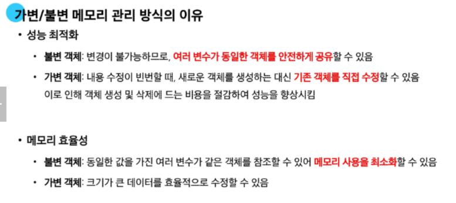

# Data Structure

- 여러 데이터를 효과적으로 관리하기 위한 구조   
(`str`, `list`, `dict` 등)

## Method

- 객체에 속한 함수이며, 각 데이터 타입별로 다양한 기능을 가진 메서드가 존재
- 메서드는 클래스(`class`) 내부에 정의되는 함수   
ex) `help` 함수를 통해 `str` 호출해보면 결과는? `class`

- 메서드 호출 방법 :    
`object.method()`

 ```python
 # 문자열 메서드 예시
print('hello'.capitalize())  # Hello

# 리스트 메서드 예시
numbers = [1, 2, 3]
numbers.append(4)
print(numbers)  # [1, 2, 3, 4]
```

# Sequence data structure

## 문자열

- 🔍 문자열 조회/탐색 및 검증 메서드
1. `.find(x)` : x의 첫 번째 위치를 반환. 없으면 -1을 반환
2. `index(x)` : x의 첫 번째 위치를 반환. 없으면 오류 발생
3. `isupper()`, `islower()` : 문자열이 모두 대문자/소문자로만 이루어져 있는지 확인
4. `isalpha()` : 문자열이 모두 알파벳으로만 이루어져 있는지 확인

- 🛠️ 문자열 조작 메서드(새로운 문자열을 반환)

1. `.replace(old, new[, count])` : x의 첫 번째 위치를 반환. 없으면 -1을 반환  

```python
# replace
text = 'Hello, world! world world'
new_text1 = text.replace('world', 'Python')
new_text2 = text.replace('world', 'Python', 1)
print(new_text1)  # Hello, Python! Python Python
print(new_text2)  # Hello, Python! world world
```

2. `.strip([chars])` : 문자열의 시작과 끝에 있는 공백 혹은 지정한 문자를 제거
숙제 ) 왼쪽 오른쪽 지우기??
```python
# strip
text = '  Hello, world!  '
new_text = text.strip()
print(new_text)  # Hello, world!
```
3. `.split(sep = None, maxsplit = -1)` : sep을 구분자 문자열로 사용하여 문자열에 있는 단어들의 리스트를 반환
```python
# split
text = 'Hello, world!'
words1 = text.split(',')
words2 = text.split()
print(words1)  # ['Hello', ' world!']
print(words2)  # ['Hello,', 'world!']
```

4. `'separator'.join(iterable)` : iterable의 문자열을 구분자(separator)로 연결한 문자열을 반환
```python
# join
words = ['Hello', 'world!']
new_text = '-'.join(words)
print(new_text)  # Hello-world!
```
5. 기타 등등
```python
# capitalize
text = 'heLLo, woRld!'
new_text1 = text.capitalize()
print(new_text1)  # Hello, world!

# title
new_text2 = text.title()
print(new_text2)  # Hello, World!

# upper
new_text3 = text.upper()
print(new_text3)  # HELLO, WORLD!

# lower
new_text4 = text.lower()
print(new_text4)  # hello, world!

# swapcase
new_text5 = text.swapcase()
print(new_text5)  # HEllO, WOrLD!
```

## 리스트

- 🛠️ 리스트 값 추가 및 삭제 메서드(원본값을 바꿈, 일반적으로 반환값이 없다)

1. `.append(x)` : 리스트 마지막에 항목 x를 추가  
```python
# append
my_list = [1, 2, 3]
my_list.append(4)
print(my_list)  # [1, 2, 3, 4]
# append는 None을 반환합니다.
print(my_list.append(5))  # None
```
2. `.extend(iterable)` : 리스트에 다른 반복 가능한 객체의 모든 항목을 추가(반복 가능한 객체가 아니면 추가할 수 없음)
```python
# extend
my_list = [1, 2, 3]
my_list.extend([4, 5, 6])
print(my_list)  # [1, 2, 3, 4, 5, 6]
```
3. `.insert(i, x)` : 리스트에 지정한 인덱스 i 위치에 항목 x를 삽입
```python
# insert
my_list = [1, 2, 3]
my_list.insert(1, 5)
print(my_list)  # [1, 5, 2, 3]
```

4. `.remove(x)` : 리스트에서 첫 번째로 일치하는 항목을 삭제
```python
# remove
my_list = [1, 2, 3, 2, 2, 2]
my_list.remove(2)
print(my_list)  # [1, 3, 2, 2, 2]
```

5. `.pop([i])` : 리스트에서 지정한 인덱스의 항목을 제거하고 반환, 작성하지 않을 경우 마지막 항목을 제거
```python
# pop
my_list = [1, 2, 3, 4, 5]
item1 = my_list.pop()
item2 = my_list.pop(0)

print(item1)  # 5
print(item2)  # 1
print(my_list)  # [2, 3, 4]
```
- 리스트 탐색 및 정렬 메서드

1. `.index(x)` : 리스트에서 첫 번째로 일치하는 항목 x의 인덱스를 반환
```python
# index
my_list = [1, 2, 3]
index = my_list.index(2)
print(index)  # 1
```
2. `.count(x)` : 리스트에서 항목 x의 개수를 반환
```python
# count
my_list = [1, 2, 2, 3, 3, 3]
counting_number = my_list.count(3)
print(counting_number)  # 3
```
3. `reverse()` : 리스트의 순서를 역순으로 변경
```python
# reverse
my_list = [1, 3, 2, 8, 1, 9]
my_list.reverse()
# reverse는 None을 반환합니다.
# print(my_list.reverse())  # None
# reverse는 원본 리스트를 변경합니다.
print(my_list)  # [9, 1, 8, 2, 3, 1]
```
4. `sort([reverse = True])` : 원본 리스트를 오름차순[내림차순]으로 변경
```python
# sort
my_list = [3, 2, 100, 1]
my_list.sort()
# sort는 None을 반환합니다.
# print(my_list.sort())  # None
# sort는 원본 리스트를 변경합니다.
print(my_list)  # [1, 2, 3, 100]

# sort(내림차순 정렬)
my_list.sort(reverse=True)
print(my_list)  # [100, 3, 2, 1]
```

# Copy
- 객체 복사의 핵심을 파악하려면, 파이썬 자료구조의 가변과 불변 두 가지 종류를 살펴봐야 함

- Mutable(가변) 객체 : 생성 후 내용을 변경할 수 있는 객체

- 변수 할당의 의미 : 파이썬에서 변수 할당은 객체에 대한 참조를 생성하는 과정(**방 주소를 주는 것**이다!!)
-> 할당 시 새로운 객체가 생성되거나 기존 객체에 대한 참조가 생성됨

```python
# 가변(mutable) 객체 예시
print('가변(mutable) 객체 예시')
a = [1, 2, 3, 4]
b = a   # b에 a주소를 할당
b[0] = 100

print(f'a의 값: {a}')  # [100, 2, 3, 4]
print(f'b의 값: {b}')  # [100, 2, 3, 4]
print(f'a와 b가 같은 객체를 참조하는가? {a is b}')  # True
## b에는 a가 복사된 게 아니라, 같은 곳을 바라본 것 뿐이다!

# 불변(immutable) 객체 예시
print('\n불변(immutable) 객체 예시')
a = 20
b = a
b = 10

print(f'a의 값: {a}')  # 20
print(f'b의 값: {b}')  # 10
print(a is b)  # False

# id() 함수를 사용한 메모리 주소 확인
print('\n메모리 주소 확인')
x = [1, 2, 3]
y = x
z = [1, 2, 3]

print(f'x의 id: {id(x)}') # x의 id: 1625586607040
print(f'y의 id: {id(y)}') # y의 id: 1625586607040
print(f'z의 id: {id(z)}') # z의 id: 1625586759808
print(f'x와 y는 같은 객체인가? {x is y}') # x와 y는 같은 객체인가? True
print(f'x와 z는 같은 객체인가? {x is z}') # x와 z는 같은 객체인가? False
```



## 얉은 복사 (Shallow Copy)
객체의 최상위 요소만 새로운 메모리에 복사하는 방법.   
내부에 중첩괸 객체가 있다면 그 객체의 참조가 복사됨

```python
# 얕은 복사
print('\n얕은 복사 예시')

# 1차원 리스트에서의 얕은 복사 (리스트 슬라이싱)
a = [1, 2, 3]
b = a[:]

print(a)  # [1, 2, 3]
print(b)  # [1, 2, 3]

# 1차원 리스트에서의 얕은 복사 (copy 메서드)
a = [1, 2, 3]
c = a.copy()

print(a)  # [1, 2, 3]
print(c)  # [1, 2, 3]


# 1차원 리스트에서의 얕은 복사 (list() 함수)
a = [1, 2, 3]
d = list(a)
a[0] = 100

print(a)  # [100, 2, 3]
print(d)  # [1, 2, 3]


# 얕은 복사의 한계
print('\n다차원 리스트 얕은 복사의 한계')
a = [1, 2, [3, 4, 5]]
b = a[:]

b[0] = 999
print(a)  # [1, 2, [3, 4, 5]]
print(b)  # [999, 2, [3, 4, 5]]

b[2][1] = 100
print(a)  # [1, 2, [3, 100, 5]]
print(b)  # [999, 2, [3, 100, 5]]

print(f'a[2]와 b[2]가 같은 객체인가? {a[2] is b[2]}')  # True
```

## 깊은 복사 (Deep Copy)
- 객체의 모든 수준의 요소를 새로운 메모리에 복사하는 방법.   
중첩된 객체까지 모두 새로운 객체로 생성됨
- `copy` 모듈에서 제공하는 `deepcopy` 함수를 사용
```python
import copy

new_object = copy.deepcopy(original_object)
```
```python
import copy

# 깊은 복사

print('깊은 복사 예시')
a = [1, 2, [3, 4, 5]]
b = copy.deepcopy(a)

b[2][1] = 100

print(a)  # [1, 2, [3, 4, 5]]
print(b)  # [1, 2, [3, 100, 5]]
print(f'a[2]와 b[2]가 같은 객체인가? {a[2] is b[2]}')  # False

# 복잡한 중첩 객체 예시
print('복잡한 중첩 객체 깊은 복사')
original = {
    'a': [1, 2, 3],
    'b': {'c': 4, 'd': [5, 6]},
}
copied = copy.deepcopy(original)

copied['a'][1] = 100
copied['b']['d'][0] = 500

print(f'원본: {original}')  # {'a': [1, 2, 3], 'b': {'c': 4, 'd': [5, 6]}}
print(f'복사본: {copied}')  # {'a': [1, 100, 3], 'b': {'c': 4, 'd': [500, 6]}}
print(
    f"original['b']와 copied['b']가 같은 객체인가? {original['b'] is copied['b']}"
)  # False
```

# 참고

## list comprehension

- 간결하고 효율적인 리스트 생성 방법(pythonic한 코드)
- 생성 방법   
1. `[expression for x in iterable]`   
2. `[expression for x in iterable if 조건식]`  

ex) 2차원 배열 생성 시 (인접행렬 생성 시) List Comprehension 활용
```python
# List Comprehension 활용 예시
# "2차원 배열 생성 시 (인접행렬 생성 시)"
data = [[0 for _ in range(5)] for _ in range(5)]
print(data)

"""
[[0, 0, 0, 0, 0],
 [0, 0, 0, 0, 0],
 [0, 0, 0, 0, 0],
 [0, 0, 0, 0, 0],
 [0, 0, 0, 0, 0]]
"""
```
## 메서드 체이닝
- 여러 메서드를 연속해서 호출하는 방식
```python
# 문자열 메서드 체이닝
text = 'heLLo, woRld!'
new_text = text
print(new_text.swapcase().replace('l','z'))  # HEzzO, WOrLD!

# 주의 : 반환값이 None인 경우는 주의해야 한다!
```

## 문자 유형 판별 메서드

1. `isdecimal()` : 문자열이 모두 숫자 문자로만 이루어져 있어야 True
2. `isdigit` : + 유니코드 숫자로 인식
3. `isnumeric` : + 분수, 지수, 루트 기호도 숫자로 인식
